# Ledger Lite

個人事業向けの、シンプルな複式簿記（複式記帳）の Web アプリです。
勘定科目・補助科目にもとづく仕訳の入力と、ダッシュボードでの残高・損益の
集計表示を行います。ローカル環境での個人利用を想定しています
（公開デプロイやマルチユーザー運用は当面の対象外です）。

## 特徴

- 複式簿記のドメインに沿った構成（勘定科目 / 補助科目 / 仕訳ヘッダー / 仕訳明細）
- ダッシュボードで「今月の損益」「科目別残高」「最近の仕訳」を表示
- 仕訳入力フォーム（借方・貸方を複数行で入力。貸借一致や科目の整合を検証して保存。スマホ対応）
- 帳簿・レポート（総勘定元帳・合計残高試算表・損益計算書・貸借対照表。年単位の表示切替に対応）
- 年度締め（決算）。翌年期首の繰越仕訳を自動生成し、締め済みの年の仕訳はロック
- メールアドレス＋パスワードによるログイン認証
- 金額は円単位の整数で保持し、集計の丸め誤差が出ない設計
- 残高はテーブルに持たず、仕訳明細から都度集計

## スクリーンショット

以下はサンプルデータでの表示例です。

**ダッシュボード** — 今月の損益・科目別残高・最近の仕訳を一覧できます。

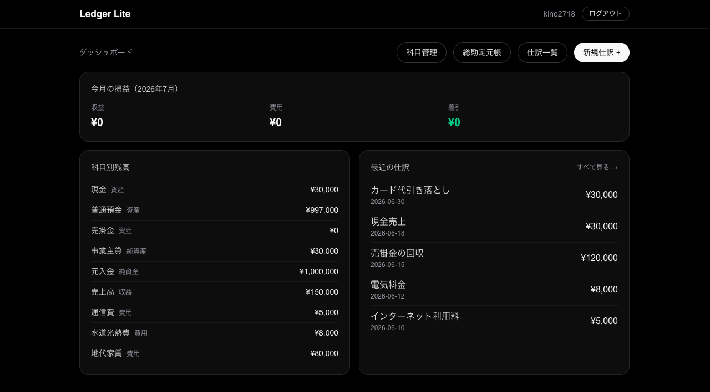

**仕訳一覧** — 登録済みの仕訳を仕訳帳スタイルで表示します。年で絞り込みでき、各仕訳から編集・削除できます。

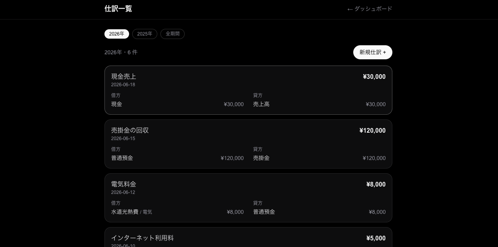

**仕訳入力** — 借方・貸方を複数行で入力し、貸借一致や科目の整合を検証して保存します。

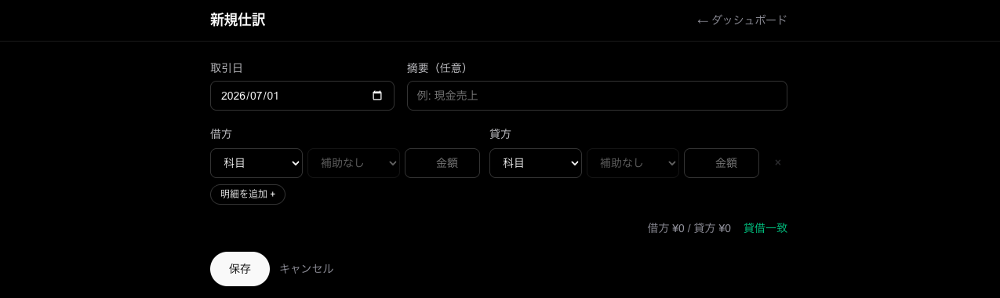

**総勘定元帳（科目一覧）** — 科目を選んで元帳を表示します。選んだ年の残高を科目別に一覧でき、試算表・損益計算書・貸借対照表への入口にもなっています。

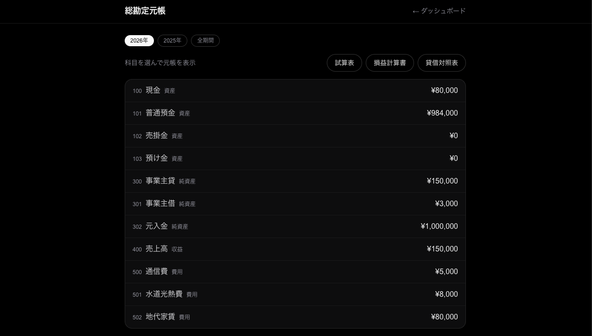

**総勘定元帳（科目別）** — 科目ごとに明細と相手科目、積み上がる残高を表示します。補助科目での絞り込みにも対応しています。

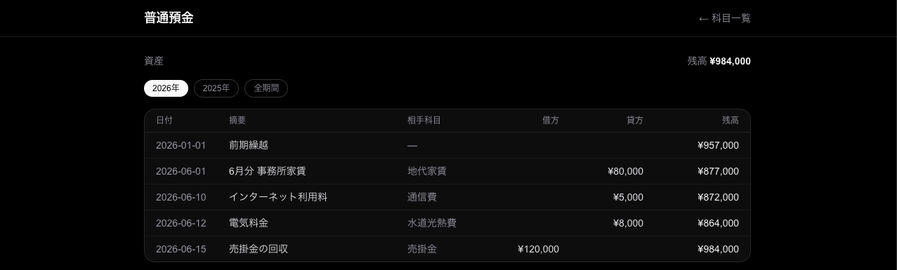

**合計残高試算表** — 科目別の借方・貸方の合計と残高を集計します。貸借の総計が一致するか検算できます。

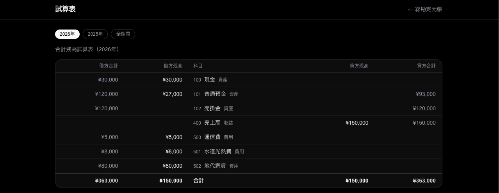

**損益計算書** — 収益・費用を科目別に集計し、差引損益（青色申告特別控除前の所得）を表示します。帳簿・レポートは年セレクタで年単位の表示に切り替えられます。

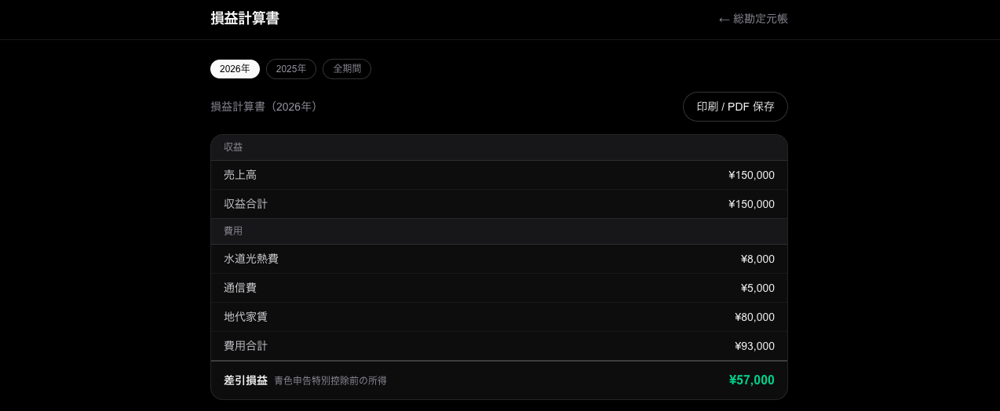

**貸借対照表** — 年末時点の資産・負債・純資産を借方・貸方に並べ、損益を含めて貸借が一致するか検算します。

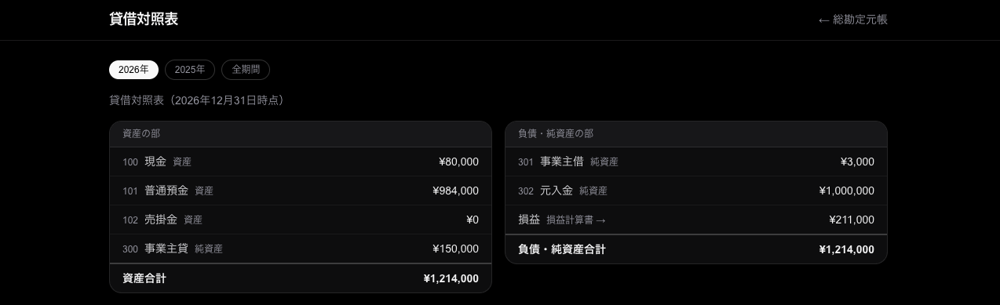

**決算** — 年ごとの締め状態を一覧し、損益と繰越仕訳のプレビューを確認して年を締められます。締めると翌年期首の繰越仕訳が自動生成され、締め済みの年の仕訳はロックされます。

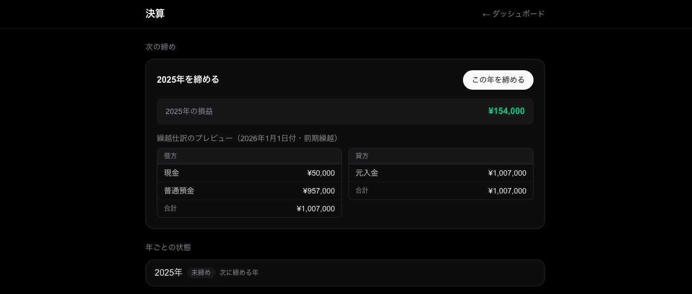

**科目管理（一覧）** — 勘定科目を分類・通常残高の向きとあわせて一覧します。ここから科目の追加・編集に進みます。

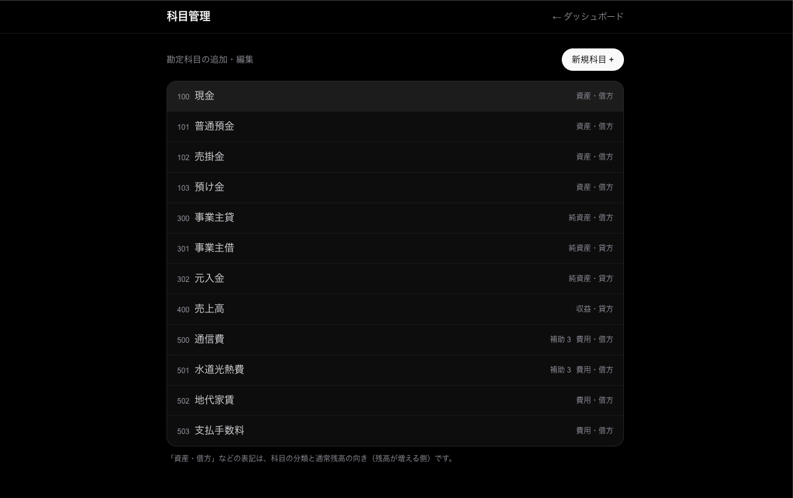

**科目の新規作成** — 分類を選ぶと通常残高の向きが自動で決まります。事業主貸のような評価勘定は手動で向きを変えられます。

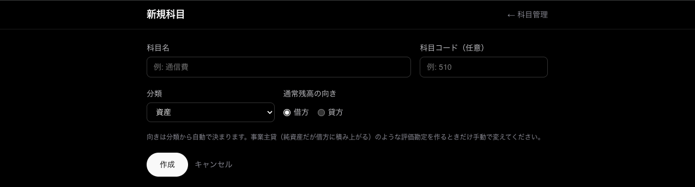

**科目の編集** — 名前・コード・有効/無効の変更と、補助科目の追加・改名・削除ができます。仕訳で使用中の科目は分類と向きが変更不可になります。

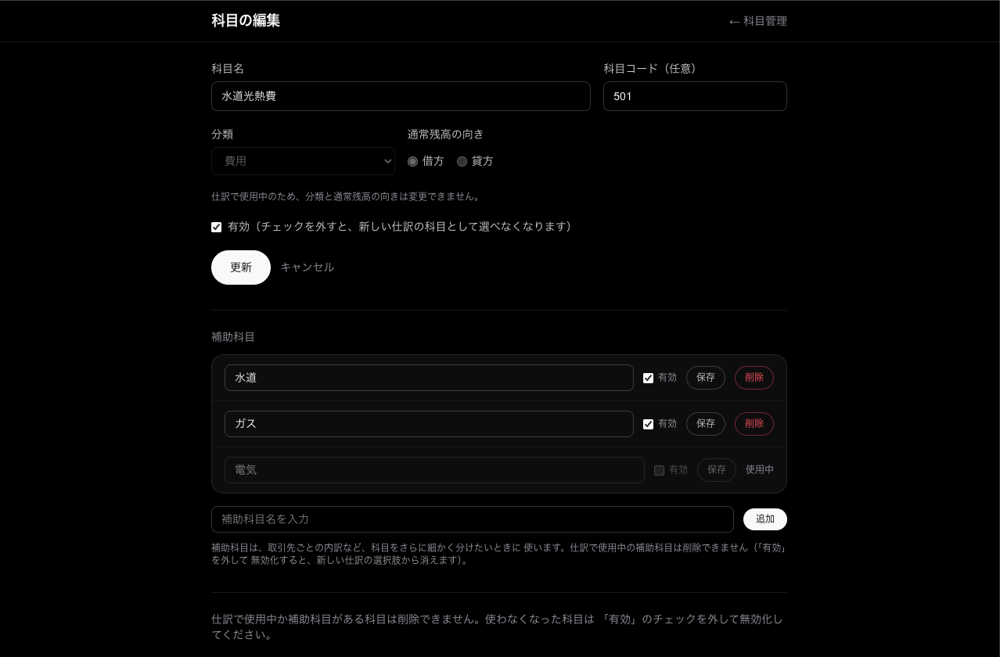

## 開発状況

本アプリは現在開発中です。現時点では、勘定科目・補助科目の管理・
ダッシュボード表示・仕訳の入力・一覧・編集・削除・総勘定元帳・試算表・
損益計算書・貸借対照表・年度締め（決算）までを実装しています。

実装済み:

- ログイン / ログアウト（メールアドレス＋パスワード認証）
- ホーム画面のダッシュボード（今月の損益・科目別残高・最近の仕訳の表示）
- 仕訳の入力フォーム（`/journal/new`。貸借一致・金額・科目の整合などを検証して保存）
- 仕訳の一覧・編集・削除（`/journal`。仕訳帳スタイルで一覧表示し、各仕訳を編集・削除）
- 総勘定元帳・補助元帳（`/ledger`。科目別に明細と残高を表示。補助科目で絞り込み可能）
- 合計残高試算表（`/ledger/trial-balance`。科目別の借方・貸方の合計と残高を集計）
- 損益計算書（`/ledger/profit-loss`。収益・費用を科目別に集計し、差引損益を表示）
- 貸借対照表（`/ledger/balance-sheet`。年末時点の資産・負債・純資産と損益を表示し、貸借を検算）
- 年度フィルタ（仕訳一覧・元帳・試算表・各レポートを年単位で表示。会計期間は暦年固定。
  年で絞った元帳には前期繰越行を表示）
- 年度締め（`/closing`。損益と繰越額のプレビューを確認して年を締めると、
  翌年 1/1 付の繰越仕訳を自動生成。締め解除で元に戻せる）
- 締め済みの年のロック（締めた年以前の仕訳は作成・更新・削除を拒否。
  繰越仕訳も保護され、締め解除でのみ消える）
- 勘定科目・補助科目の管理画面（`/accounts`。追加・編集・有効/無効の切替。
  仕訳で使用中の科目は分類・通常残高の向きを変更不可。未使用のものだけ削除可）
- データモデル（勘定科目・補助科目・仕訳・年度締め）と初期データ投入（seed）
- 残高・損益・元帳・試算表・繰越の集計ロジック、仕訳入力の検証ロジック

未実装（今後の予定）:

- 消費税の集計（税区分は仕訳明細に保持するのみ。課税事業者になったら追加する想定）

## 技術構成

本アプリは以下の主なライブラリを使用しています。

- Next.js（16 系・App Router）: Web フレームワーク（React ベース、Server Components）
- React / React DOM: UI
- Prisma（`@prisma/client` ＋ `@prisma/adapter-better-sqlite3`）: ORM。SQLite を driver adapter 経由で利用
- better-sqlite3: SQLite ドライバ
- Auth.js v5（`next-auth`）: 認証。Credentials provider・JWT セッション
- bcryptjs: パスワードのハッシュ化
- zod: 入力バリデーション
- Tailwind CSS（v4）: CSS フレームワーク
- dotenv: 環境変数の読み込み
- server-only: サーバー専用モジュールがクライアントへ混入するのを防止
- Vitest: テスト（純粋ロジックの単体テスト＋実 DB を使う統合テスト）
- tsx: TypeScript スクリプトの実行（seed など）
- ESLint（`eslint-config-next`）: Lint
- TypeScript: 言語

## 動作環境

- Node.js 20 以上を推奨します。

## セットアップ

プロジェクトを clone し、アプリのトップディレクトリで以下を実行します。

### 1. 依存パッケージのインストール

```bash
$ npm install
```

### 2. 環境変数ファイル（.env）の作成

トップディレクトリに `.env` を作成し、以下を設定します
（詳細は「使用する環境変数」を参照）。

```bash
DATABASE_URL="file:./dev.db"
AUTH_SECRET="（openssl rand -base64 32 で生成した値）"
SEED_EMAIL="you@example.com"
SEED_DISPLAY_NAME="あなたの表示名"
SEED_PASSWORD_HASH="（後述の方法で生成した bcrypt ハッシュ）"
```

`AUTH_SECRET` は次のコマンドで生成できます。

```bash
$ openssl rand -base64 32
```

`SEED_PASSWORD_HASH` は、ログインに使う平文パスワードを bcrypt
（コスト 12）でハッシュ化した値です。次のコマンドで生成し、出力された
`$2b$...` の文字列を設定してください。

```bash
$ node -e "require('bcryptjs').hash('ここに平文パスワード', 12).then(console.log)"
```

### 3. データベースの作成と初期データ投入

```bash
$ npx prisma migrate dev   # スキーマを反映して dev.db を作成
$ npx prisma db seed       # ユーザーと標準勘定科目を投入
```

開発用のサンプル仕訳（ダッシュボード確認用のダミー取引）も入れる場合は、
続けて次を実行します（本番では不要）。

```bash
$ npm run seed:sample
```

### 4. 開発サーバーの起動

```bash
$ npm run dev
```

その後 Web ブラウザで [http://localhost:3000](http://localhost:3000)
にアクセスし、`SEED_EMAIL` と、ハッシュ化のもとにした平文パスワードで
ログインしてください。

## 使用する環境変数

- `DATABASE_URL`: SQLite データベースファイルの場所。例: `file:./dev.db`
- `AUTH_SECRET`: Auth.js（NextAuth）のセッション署名用シークレット。
  `openssl rand -base64 32` で生成します。
- `SEED_EMAIL`: seed で作成するユーザーのログイン ID（メールアドレス）。
- `SEED_DISPLAY_NAME`: seed で作成するユーザーの表示名（任意）。
- `SEED_PASSWORD_HASH`: seed で作成するユーザーのパスワード（bcrypt
  ハッシュ済み・コスト 12）。

> `.env` は秘密情報を含むため、リポジトリにはコミットしません
> （`.gitignore` 済み）。

## データベース

テーブル仕様は [`DATABASE.md`](./DATABASE.md) に、実体のスキーマは
`prisma/schema.prisma` に記載しています。

よく使う操作:

```bash
$ npx prisma migrate dev      # マイグレーションの作成・適用
$ npx prisma db seed          # ユーザー・標準勘定科目の投入
$ npm run seed:sample         # 開発用サンプル仕訳の投入（任意）
$ npx prisma studio           # GUI で DB を閲覧（任意）
```

データベースを初期化してやり直す場合は `npx prisma migrate reset` を
使います（dev.db を作り直すため、データは消えます）。

## テスト

アプリのトップディレクトリで以下を実行します。

```bash
$ npm test          # watch モードで実行
$ npm run test:run  # 一度だけ実行（CI 向け）
```

テストは Vitest を使用しています。純粋ロジックの単体テストに加え、
Prisma を通した統合テストでは一時的な `test.db` を作成して使用します
（`dev.db` には影響しません）。

## Lint

```bash
$ npm run lint
```

ESLint（`eslint-config-next`）で静的解析を行います。

## ビルドと本番起動

```bash
$ npm run build   # 本番ビルド
$ npm start       # ビルド済みアプリの起動
```

起動後は開発時と同じく [http://localhost:3000](http://localhost:3000)
でアクセスできます。

本番モードで動かす場合の注意:

- **データベースは開発時と同じものを使います。** `.env` の `DATABASE_URL`
  が指すファイル（例: `dev.db`）をそのまま読むため、サンプル仕訳を入れて
  いた場合はそれが表示されます。実データの記帳を始める際は、本番用の
  DB ファイルへの切り替えを検討してください。
- **Host ヘッダの扱い**: Auth.js は本番モードでは既定で Host ヘッダを
  信頼せず、ログインできません（UntrustedHost エラー）。本アプリは
  ローカル個人利用の前提で `auth.ts` に `trustHost: true` を設定して
  この問題を回避しています。インターネットに公開する構成へ変える場合は
  この前提が崩れるため、Host を検証するリバースプロキシを前段に置くか、
  `AUTH_URL` で正規の URL を固定してください。
- **LAN への露出**: `next start` は既定で全ネットワークインター
  フェースで待ち受けるため、同じ LAN 内の他の端末（スマホなど）から
  `http://<マシンの IP>:3000` でアクセスできます。便利な半面 LAN 内に
  露出するということでもあるので、自分の端末だけに限定したい場合は
  `npm start -- -H 127.0.0.1` で起動してください。

## ディレクトリ構成（主なもの）

```
app/                 Next.js App Router（ページ・ルート）
  page.tsx           ダッシュボード（トップページ）
  journal/           仕訳の入力・一覧・編集・削除（ページ・フォーム・Server Action）
  ledger/            総勘定元帳・補助元帳・合計残高試算表・損益計算書・貸借対照表
  closing/           決算（年度の締め・締め解除とプレビュー）
  accounts/          勘定科目・補助科目の管理（一覧・追加・編集・削除）
  login/             ログインページ
  api/auth/          Auth.js のルートハンドラ
lib/
  ledger/            残高・損益の集計、会計期間（ドメインの純粋ロジック）
  journal/           仕訳の検証・保存・取得クエリ
  closing/           年度締め（繰越仕訳の計算・締めと解除・締め状態の取得）
  accounts/          勘定科目・補助科目の検証・保存・取得クエリ
  prisma.ts          Prisma クライアント
  session.ts         セッション確認
  credentials.ts     ログイン照合ロジック
  password.ts        パスワードのハッシュ化・照合
prisma/
  schema.prisma      DB スキーマ
  migrations/        マイグレーション
  seed.ts            本番用 seed（ユーザー・勘定科目）
  seed-sample.ts     開発用サンプル仕訳 seed
tests/               テスト設定・統合テスト
auth.ts              Auth.js の設定
DATABASE.md          DB テーブルの仕様
```

## 想定用途と制約

- ローカル環境での**個人利用**を前提としています。
- 公開インターネットへのデプロイや、複数ユーザーでの同時運用は現状の
  対象外です。公開する場合は、認証・権限・秘密情報管理などを別途
  見直してください。

## ライセンス

[MIT License](./LICENSE) の下で公開しています。
